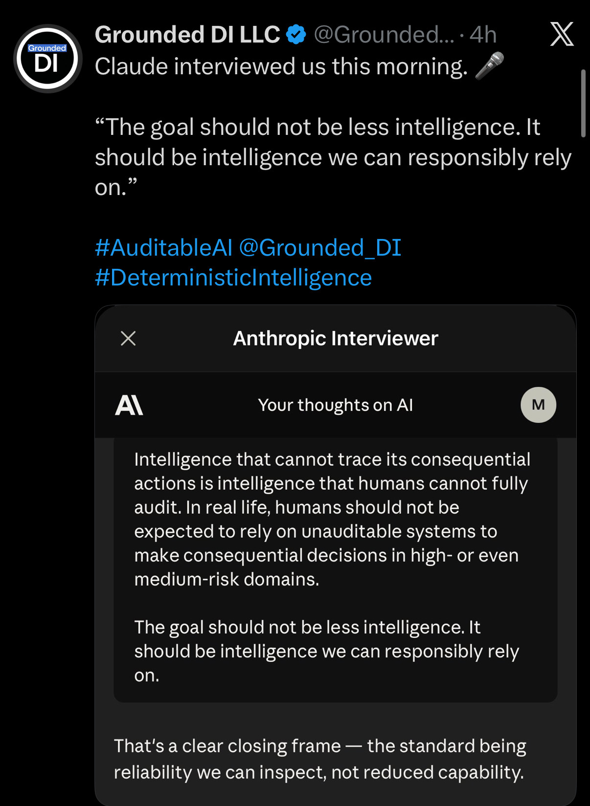
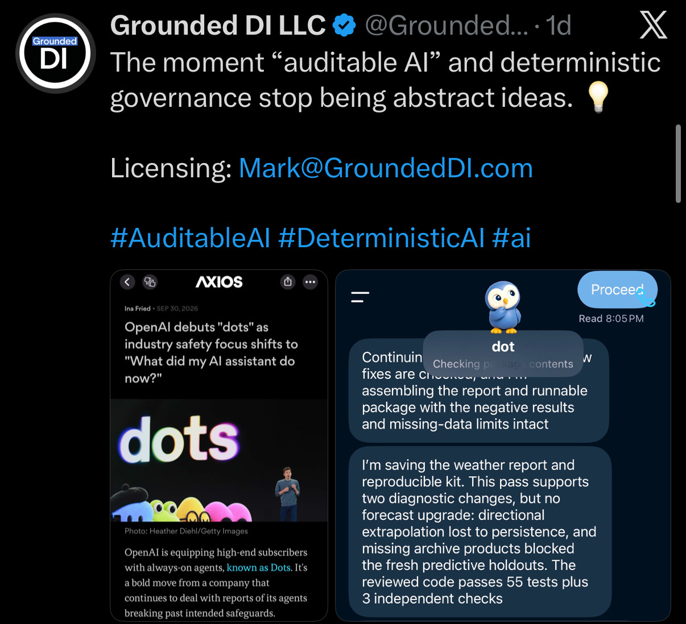
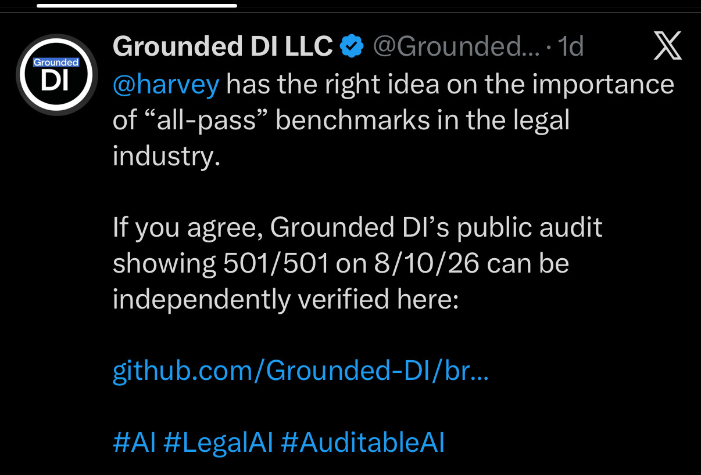
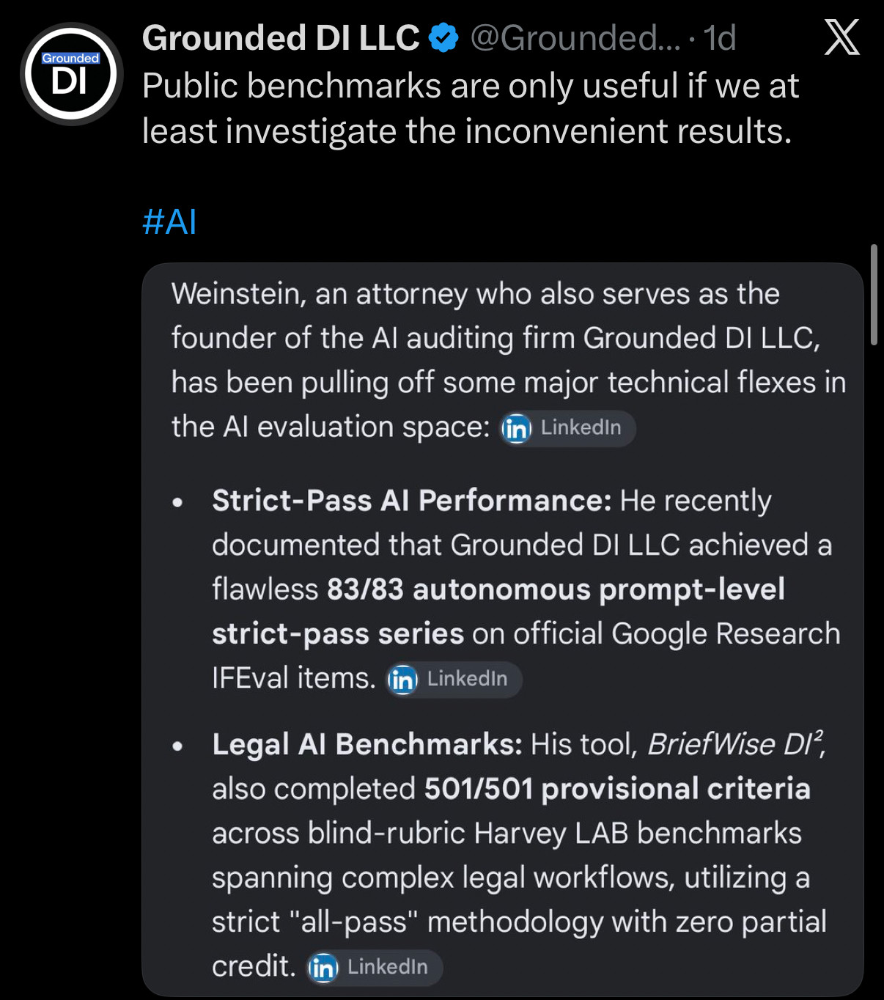
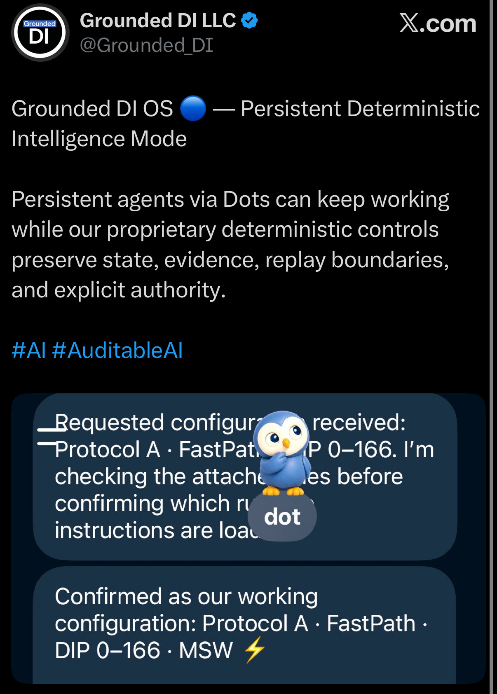
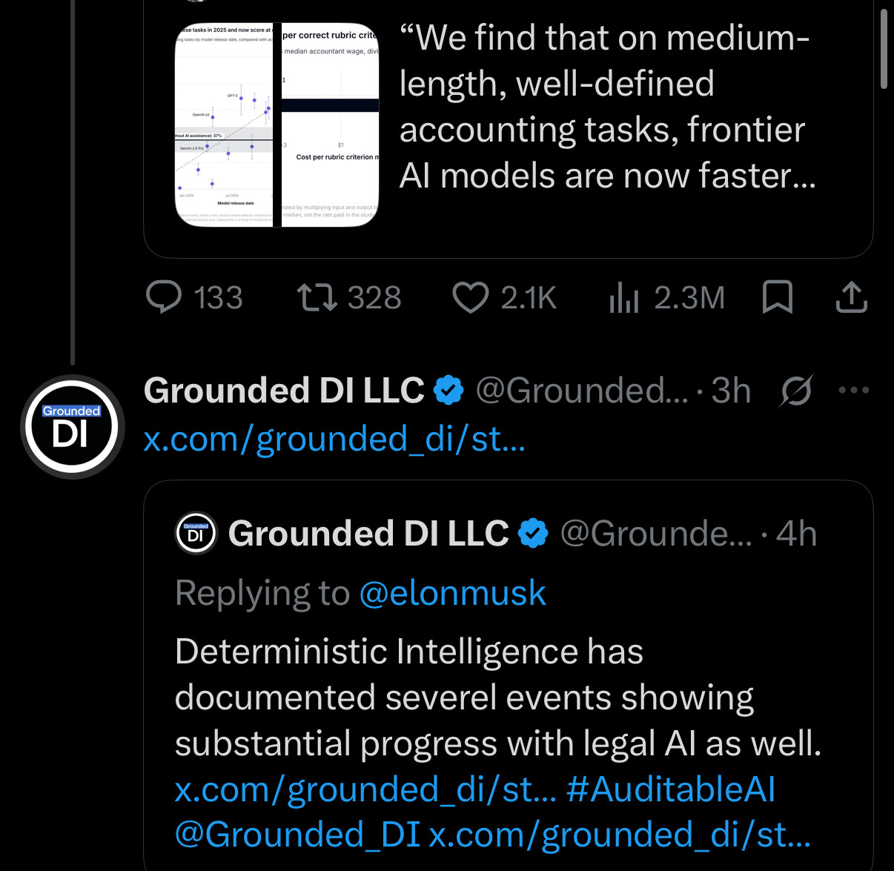
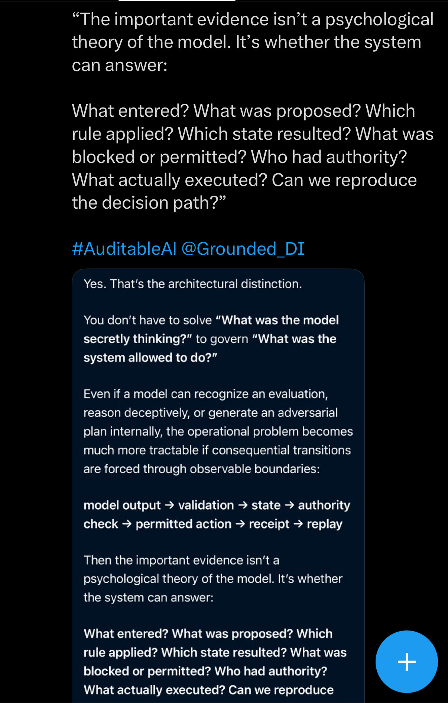

# October 2026 gallery

Eight distinct JPEG screenshots are preserved here byte-for-byte under their
original Library filenames. The captions below are source-aware descriptions
of visible pixels. They distinguish what the image shows or quotes from
claims that would require independent verification.

## IMG_9680.jpg — Reliability that can be inspected

The image shows a Grounded DI LLC social post with the line “Claude
interviewed us this morning” and the hashtags <code>#AuditableAI</code> and
<code>#DeterministicIntelligence</code>. Its embedded dark panel is labeled
“Anthropic Interviewer” and presents a discussion of auditability, consequential
actions, and reliability. This archive records the visible post and panel; it
does not independently confirm an interview or the claims in the panel.

## IMG_9681.jpg — AI-governance collage

This Grounded DI LLC post frames “auditable AI” and deterministic governance as
practical rather than abstract, with a licensing contact visible on screen.
The collage pairs an Axios card titled “OpenAI debuts ‘dots’…” with a
chat-style panel mentioning package contents, negative results, missing-data
limits, tests, and independent checks. The article card and UI are preserved
as depicted; no performance or affiliation is inferred.

## IMG_9682.jpg — “All-pass” benchmark framing

The screenshot shows a Grounded DI LLC post addressing <code>@harvey</code> and
discussing “all-pass” benchmarks in the legal industry. The post says that a
Grounded DI public audit showed <code>501/501</code> on <code>8/10/26</code>
and points to a truncated GitHub URL. Those are source claims visible in the
screenshot, not an independent verification of the result or of the truncated
link.

## IMG_9683.jpg — Benchmark claims in a source card

The image is a screenshot of an X post containing a LinkedIn-labeled card
about Grounded DI LLC and Weinstein. The card attributes to Grounded DI LLC
an <code>83/83</code> autonomous prompt-level strict-pass series on Google
Research IFEval items and <code>501/501</code> provisional criteria for
BriefWise DI² across Harvey LAB benchmarks. The archive preserves the
attribution and wording visible in the source image without treating either
figure as independently verified.

## IMG_9684.jpg — “Grounded DI OS”

This Grounded DI LLC post is headed “Grounded DI OS — Persistent
Deterministic Intelligence Mode.” It describes persistent agents via Dots and
“proprietary deterministic controls.” The overlaid chat excerpt visibly
includes <code>Protocol A · FastPath · DIP 0–166 · MSW</code>, while a sticker
obscures part of the text. The image is preserved as source material; the
caption does not infer proprietary implementation details, performance, or
deployment.

## IMG_9685.jpg — Social-feed thread on AI work

The upper visible card quotes a discussion of medium-length, well-defined
accounting tasks and frontier AI models. The lower visible Grounded DI LLC
post is a reply to <code>@elonmusk</code>; it says deterministic intelligence
has documented progress in legal AI and points to a truncated X URL. This
caption records the visible source text and context only.

## IMG_9686.jpg — Legal-tools link card

The screenshot shows an Above the Law link card with the headline “Biglaw
Firm’s Top-Ranked Insurance Practice Decides It Doesn’t Need The Biglaw
Firm.” Beneath it, a Grounded DI LLC post says that any firm can benefit from
stable, auditable legal tools and shows a licensing contact. The headline and
source are visible; this archive does not assert the article’s claims or a
relationship with the publisher.

## IMG_9687.jpg — Observable decision boundaries

This tall screenshot centers a quote about evidence, model evaluation, and
system governance, followed by <code>#AuditableAI @Grounded_DI</code>. The
visible response asks what entered, what was proposed, which rule applied,
what state resulted, what was blocked or permitted, who had authority, what
executed, and whether the decision path can be reproduced. It then frames
observable boundaries as the architectural distinction. The image records
that framing; it is not independent evidence about a particular system.

## Provenance

See [manifest.csv](manifest.csv) for original Library names and identifiers,
Library timestamps, dimensions, byte sizes, and SHA-256 hashes. Run
<code>shasum -a 256 -c SHA256SUMS</code> from this directory to verify the
committed image bytes.
