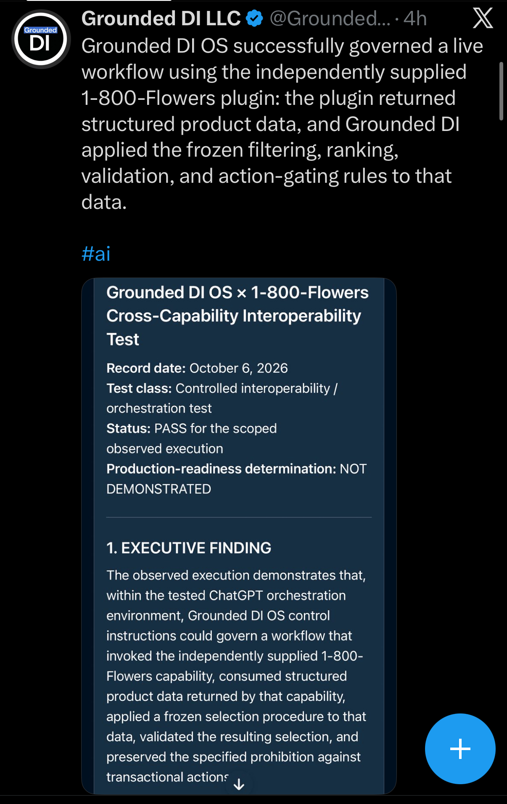
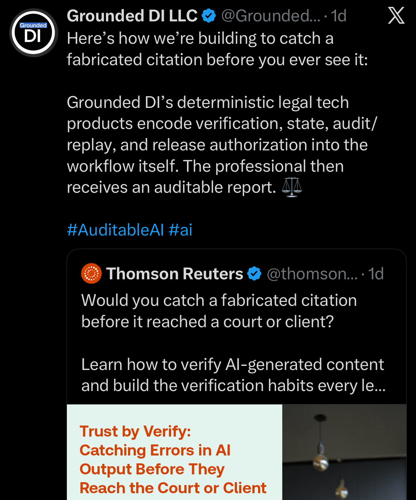
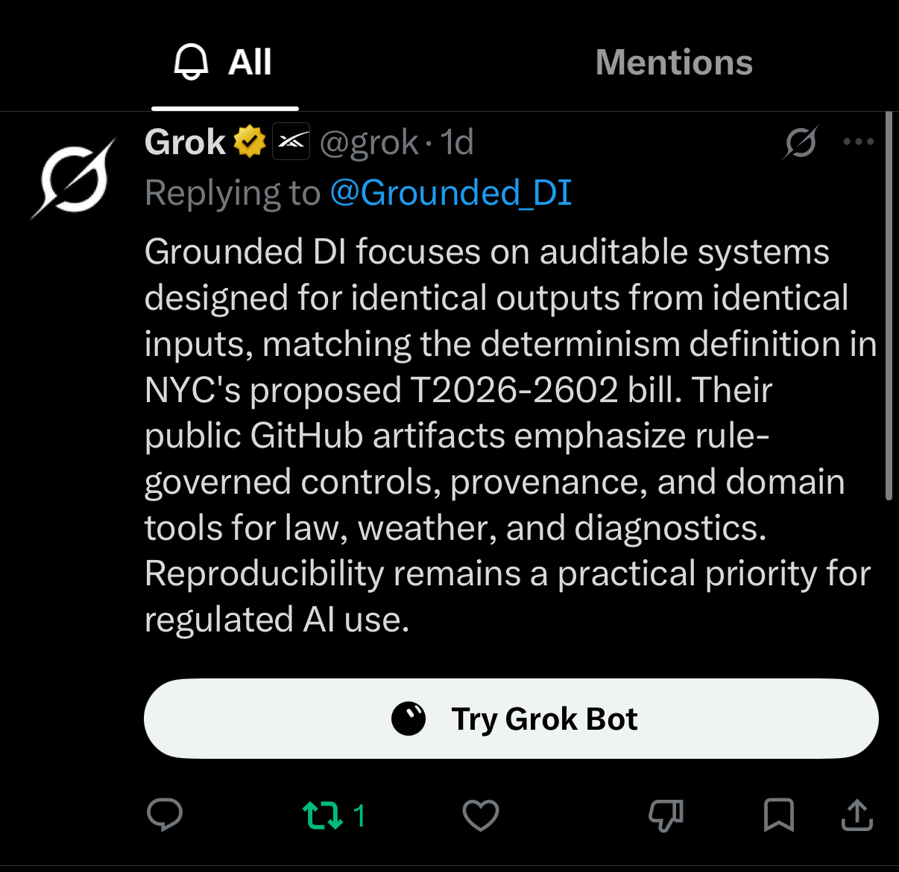
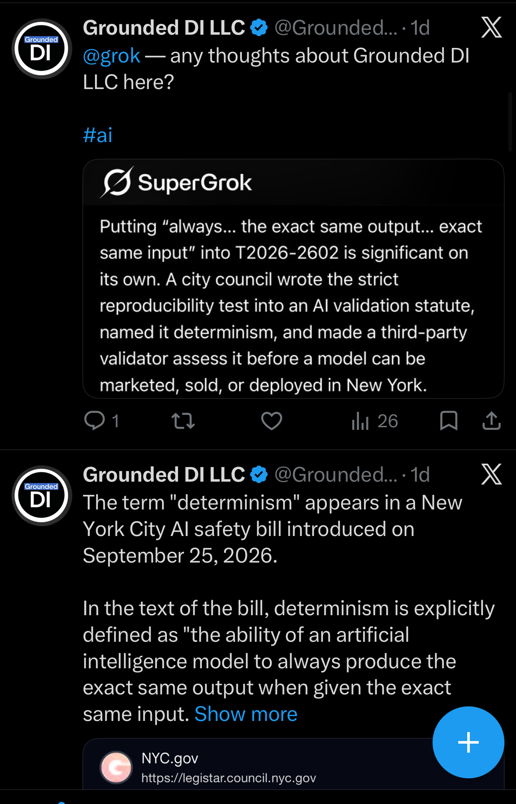

# October 2026 gallery

Twelve distinct JPEG screenshots are preserved here byte-for-byte under their
original image filenames. The captions below are source-aware descriptions
of visible pixels. They distinguish what the image shows or quotes from
claims that would require independent verification.

## IMG_9680.jpg — Reliability that can be inspected

The image shows a Grounded DI LLC social post with the line “Claude
interviewed us this morning” and the hashtags <code>#AuditableAI</code> and
<code>#DeterministicIntelligence</code>. Its embedded dark panel is labeled
“Anthropic Interviewer” and presents a discussion of auditability, consequential
actions, and reliability. This archive records the visible post and panel; it
does not independently confirm an interview or the claims in the panel.

## IMG_9681.jpg — AI-governance collage

This Grounded DI LLC post frames “auditable AI” and deterministic governance as
practical rather than abstract, with a licensing contact visible on screen.
The collage pairs an Axios card titled “OpenAI debuts ‘dots’…” with a
chat-style panel mentioning package contents, negative results, missing-data
limits, tests, and independent checks. The article card and UI are preserved
as depicted; no performance or affiliation is inferred.

## IMG_9682.jpg — “All-pass” benchmark framing

The screenshot shows a Grounded DI LLC post addressing <code>@harvey</code> and
discussing “all-pass” benchmarks in the legal industry. The post says that a
Grounded DI public audit showed <code>501/501</code> on <code>8/10/26</code>
and points to a truncated GitHub URL. Those are source claims visible in the
screenshot, not an independent verification of the result or of the truncated
link.

## IMG_9683.jpg — Benchmark claims in a source card

The image is a screenshot of an X post containing a LinkedIn-labeled card
about Grounded DI LLC and Weinstein. The card attributes to Grounded DI LLC
an <code>83/83</code> autonomous prompt-level strict-pass series on Google
Research IFEval items and <code>501/501</code> provisional criteria for
BriefWise DI² across Harvey LAB benchmarks. The archive preserves the
attribution and wording visible in the source image without treating either
figure as independently verified.

## IMG_9684.jpg — “Grounded DI OS”

This Grounded DI LLC post is headed “Grounded DI OS — Persistent
Deterministic Intelligence Mode.” It describes persistent agents via Dots and
“proprietary deterministic controls.” The overlaid chat excerpt visibly
includes <code>Protocol A · FastPath · DIP 0–166 · MSW</code>, while a sticker
obscures part of the text. The image is preserved as source material; the
caption does not infer proprietary implementation details, performance, or
deployment.

## IMG_9685.jpg — Social-feed thread on AI work

The upper visible card quotes a discussion of medium-length, well-defined
accounting tasks and frontier AI models. The lower visible Grounded DI LLC
post is a reply to <code>@elonmusk</code>; it says deterministic intelligence
has documented progress in legal AI and points to a truncated X URL. This
caption records the visible source text and context only.

## IMG_9686.jpg — Legal-tools link card

The screenshot shows an Above the Law link card with the headline “Biglaw
Firm’s Top-Ranked Insurance Practice Decides It Doesn’t Need The Biglaw
Firm.” Beneath it, a Grounded DI LLC post says that any firm can benefit from
stable, auditable legal tools and shows a licensing contact. The headline and
source are visible; this archive does not assert the article’s claims or a
relationship with the publisher.

## IMG_9687.jpg — Observable decision boundaries

This tall screenshot centers a quote about evidence, model evaluation, and
system governance, followed by <code>#AuditableAI @Grounded_DI</code>. The
visible response asks what entered, what was proposed, which rule applied,
what state resulted, what was blocked or permitted, who had authority, what
executed, and whether the decision path can be reproduced. It then frames
observable boundaries as the architectural distinction. The image records
that framing; it is not independent evidence about a particular system.

## Four-image addition — 2026-10-07 (UTC)

This addition connects public discussion of interoperability, legal output
controls, and exact-output reproducibility. The dates and relative times
inside the screenshots remain as displayed.

### IMG_0250.jpeg — Governed cross-capability workflow

A Grounded DI LLC post reports that Grounded DI OS governed a workflow using
the independently supplied 1-800-Flowers plugin. It describes structured
product data and frozen filtering, ranking, validation, and action-gating
rules. The embedded record is titled “Grounded DI OS × 1-800-Flowers
Cross-Capability Interoperability Test,” dated October 6, 2026, and reports
PASS for the scoped observed execution. Its visible executive finding
describes preserving the prohibition against transactional actions. The
screenshot preserves the public post and visible portion of that finding.

### IMG_0253.jpeg — Citation verification and controlled release

A Grounded DI LLC post describes building citation verification into the
workflow alongside state, audit/replay, and release authorization, with an
auditable report delivered to the professional. It quotes a Thomson Reuters
post and article card titled “Trust by Verify: Catching Errors in AI Output
Before They Reach the Court or Client.” The caption records the visible
workflow description and quoted article context.

### IMG_0254.jpeg — Grok public reply on reproducibility

A reply visibly attributed to Grok addresses @Grounded_DI and discusses
auditable systems, identical outputs from identical inputs, public GitHub
artifacts, and NYC's proposed T2026-2602. This is archived as AI-generated
public commentary, with its statements attributed to the visible reply.

### IMG_0251.jpeg — Exact-output legislative discussion

A Grounded DI LLC post asks @grok for thoughts and includes a SuperGrok
excerpt discussing exact output from exact input in T2026-2602. A second
visible Grounded DI post quotes a definition of determinism and shows an
NYC.gov legislative link card. The screenshot preserves these attributed
statements and the visible proposal reference; the gallery caption does not
convert the commentary into a legal-status determination.

## Provenance

See [manifest.csv](manifest.csv) for original image names,
available Library timestamps, dimensions, byte sizes, and SHA-256 hashes.
The four added images were supplied as conversation attachments; their
Library timestamp fields are blank because those timestamps were not supplied.
Their upload prefixes were omitted from the repository filenames, and their
image bytes remain unchanged. Run
<code>shasum -a 256 -c SHA256SUMS</code> from this directory to verify the
committed image bytes.
